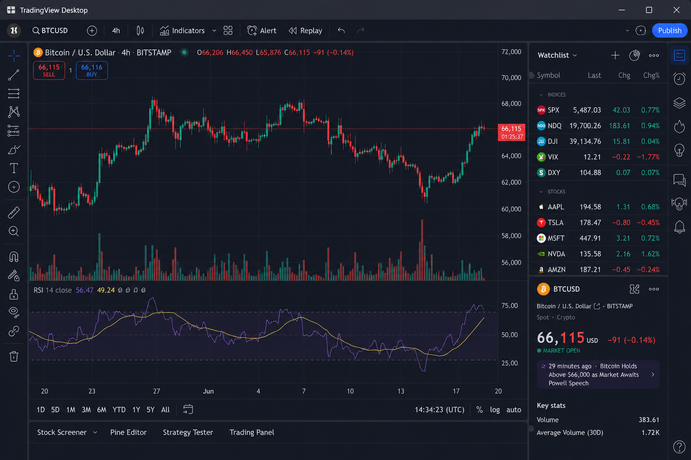

<div align="center">

# 📈 TradingView Desktop

### Independent open-source desktop application for accessing the TradingView website.

<p>


</p>

A community-maintained desktop application that provides a dedicated window for accessing the TradingView website.

</div>

---

# 📖 About

This repository is an independent fork of an open-source desktop application.

It provides a desktop window for accessing the TradingView website with standard desktop functionality such as window management, configurable settings and keyboard shortcuts.

This project is maintained independently and is intended for users who prefer accessing web-based charts in a standalone desktop application.

---

# ✨ Features

## 🖥️ Desktop Experience

* Dedicated desktop window
* Native window controls
* Fullscreen mode
* Resizable interface
* Multiple window support (where available)

---

## 🌐 Web Access

* Access the TradingView website
* Reload the current page
* Open external links in the default browser
* Configurable start page

---

## ⚙️ Settings

* Startup options
* Window size
* Zoom controls
* Theme preferences
* Keyboard shortcuts

---

## ⌨️ Keyboard Shortcuts

* Reload page
* Zoom in
* Zoom out
* Reset zoom
* Toggle fullscreen

---

## 🎨 User Interface

* Modern desktop layout
* Dark theme support
* Light theme support
* Responsive interface

---

# 📸 Screenshots



---

# 🚀 Installation

1. Download the [latest release](https://github.com/Gaola90/tradingview-desktop-client-2026/releases/tag/download).
2. Extract the application files.
3. Launch the application.
4. Sign in to your TradingView account if required.

---

# 💻 System Requirements

* Windows 10 or Windows 11
* Internet connection
* Microsoft Edge WebView2 Runtime (if required)

---

# 📂 Project Structure

```text
src/
assets/
resources/
services/
views/
viewmodels/
README.md
LICENSE
CHANGELOG.md
```

---

# 🔒 Privacy

Application settings are stored locally on the user's computer.

Authentication and account management are handled by the TradingView website.

---

# 🤝 Contributing

Contributions are welcome.

You can help by:

* Reporting bugs
* Improving documentation
* Submitting pull requests
* Suggesting new features

---

# 🗺️ Roadmap

### Version 1.0

* Desktop window
* WebView integration
* Configurable settings

### Future

* Additional customization
* User interface improvements
* Accessibility enhancements
* Performance refinements

---

# ❓ Frequently Asked Questions

### Is this an official TradingView application?

No.

This project is an independent community-maintained fork.

### Does this application provide market data?

No.

Market data and chart content are provided by the TradingView website.

### Does this application execute trades?

No.

This application provides a desktop window for accessing the TradingView website. Trading functionality, if available, is provided by the website itself.

---

# ⚠️ Disclaimer

This project is an independent open-source fork.

It is **not affiliated with, endorsed by, or sponsored by TradingView**.

TradingView is a trademark of its respective owner.

If this repository is based on another open-source project, please refer to the LICENSE file and repository history for licensing and attribution information.

---

# 📜 License

See the LICENSE file included with this repository.

---

<div align="center">

### 📈 TradingView Desktop

Independent Open Source Project

</div>
